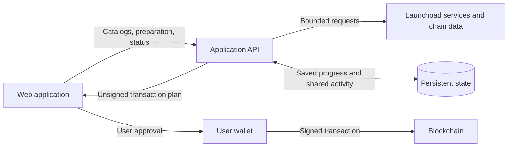

# Farmgun

**Token launches, market activity, and creator fees in one interface.**

A noncustodial launchpad for Robinhood Chain and Base. Prepare a token, choose
supported launch destinations, and approve transactions through your wallet.

[Visit Farmgun](https://farmgun.fun/) · [Feedback](https://github.com/ethduke/farmgun-showcase/issues)

Public showcase · Application source remains private.

<!-- Add real captures when ready; see media/README.md.

-->

## Features

- Token drafts with artwork, saved across reloads.
- Launchpad and market selection across two chains.
- Live Robinhood market feed with shared narrative arrivals and token counts.
- Creator-fee discovery and wallet-approved claims.

Integrations: Longbow, O1, and pons on Robinhood; O1 and stonx on Base.
Availability varies by deployment and launchpad.

## How it works

## Agent-assisted launches

Install the reusable [Farmgun launch skill](skills/farmgun-launch/SKILL.md) by
copying the `skills/farmgun-launch` folder into your agent's skills directory.
It covers wallet setup, launch preparation, budget checks, and recovery.

Example: “Use farmgun-launch to prepare Quorvix / QVXL on O1 / ETH on Base.
Use my supplied image and a maximum total spend of 0.001 ETH, including gas.
Show the prepared launch for wallet approval.”

The skill uses the site's wallet flow. Installing it does not provide a headless
signer or authorize transactions.

Give a browser-capable agent the [site overview](https://farmgun.fun/llms.txt)
and [agent guide](https://farmgun.fun/agent-guide.md), then specify the chain,
launchpad, pairing, token details, and artwork.

API base: `https://farmgun.fun`. All routes below accept JSON `POST` requests with
`Content-Type: application/json`, the configured site `Origin`, and
`x-fungun-intent` matching the operation name (for example, `catalog`).

| Endpoint | Purpose |
| --- | --- |
| `/api/catalog` | Read available pairings for a chain. |
| `/api/ticker` | Check supported ticker reservations. |
| `/api/fomo` | Read tracked activity and shared narratives. |
| `/api/launch-estimate` | Get a preliminary launch-cost estimate. |
| `/api/launch-prepare` | Prepare a validated unsigned transaction or return recovery context. |
| `/api/launch-reserve` | Record wallet dispatch for a prepared intent; does not reserve a ticker on-chain. |
| `/api/launch-status` | Check an existing launch's outcome. |
| `/api/fees` | Discover supported creator-fee positions. |
| `/api/claim-prepare` | Prepare a claim for wallet review. |

Example bodies: catalog `{"chainId":4663}`; activity `{}`.
Full schemas and prerequisites are in the [agent guide](https://farmgun.fun/agent-guide.md).

The flow is `launch-estimate` → `launch-prepare` → `launch-reserve` → wallet approval
→ `launch-status`, with artwork publication before preparation.

Example requests to your agent:

| Request | Example prompt |
| --- | --- |
| Single token | “Prepare Quorvix / QVXL on O1 / ETH on Robinhood. Use my supplied image and show the launch for wallet approval.” |
| Several tokens | “Prepare Quorvix / QVXL and Lantern / LANT on O1 / ETH on Base, using their supplied images. Show both drafts, then launch each after my approval.” |
| Launch by narrative | “Read the current Robinhood narratives. Suggest three original token concepts for one group, with names, tickers, and artwork ideas. After I choose, prepare it on O1 / ETH on Robinhood for wallet approval.” |

Multiple tokens and narrative selection are agent-coordinated workflows, processed
one draft at a time. There is no batch or narrative-launch endpoint. Each launch
needs wallet approval through the app's validated flow.

Where supported, experimental browser tools `read_launch_preview` and
`stage_coin_identity` let agents inspect and edit a draft; they do not sign or
launch. Otherwise, the agent uses the ordinary interface.

## Engineering highlights

- **Validated launch plans.** The API and browser validate transaction plans.
  Simulation and funding checks precede wallet approval.
- **Recoverable operations.** Persistent launch records support outcome checks
  after interruptions. Cached reads, bounded retries, and separate launch budgets
  control provider load.
- **Shared market state.** Narrative arrivals and counts survive reloads and API
  restarts. Token deduplication prevents multiple pools from inflating counts.

## Stack

TypeScript · React · Tailwind CSS · Node.js · SQLite · wagmi · viem

<!-- Optional captures:

[Watch a short walkthrough](media/walkthrough.mp4)
-->
